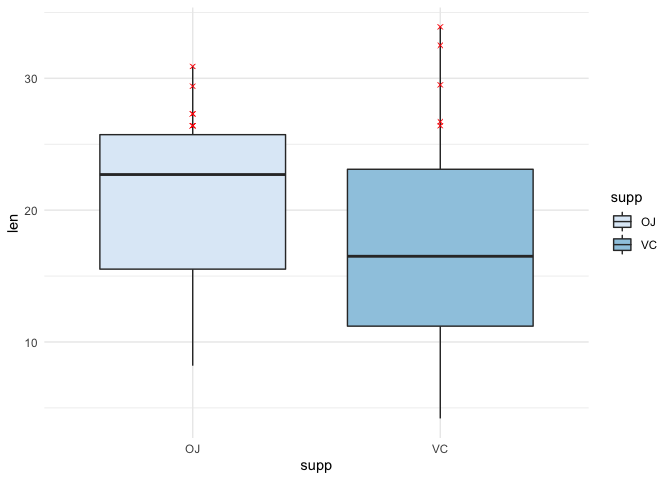

<!-- README.md is generated from README.Rmd. Please edit that file -->

# fancybox

<!-- badges: start -->
<!-- badges: end -->

The goal of fancybox is to provide more detailed versions of
ggplot2-boxplots, such as a boxplot with top N observations. These
visualizations may provide better understanding of the data and both
between- and within-group differences

## Installation

fancybox is not available on CRAN, however, you can install it from the
Github using the following command:

``` r
devtools::install_github("mlaricheva/fancybox", ref = "0.1.0")
```

## Example

The package allows you to use out-of-the-box functions with user-defined
parameters instead of writing complicated dplyr flows:

``` r
library(fancybox)
top_n_boxplot(ToothGrowth, len, supp, 5) 
```


